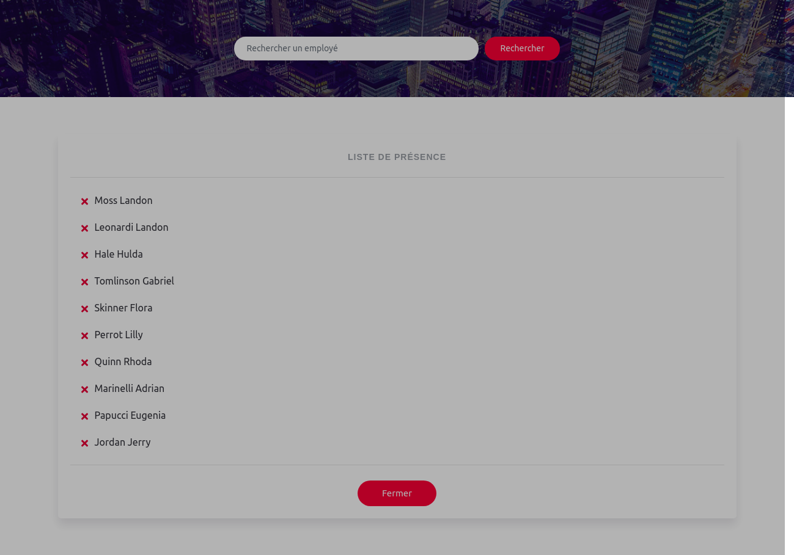

# Description
Il s'agit d'une application de contrôle de présence dans une entreprise. 
En effet ce projet est un test de sélection pour un stage au sein d'une entreprise de la place 
(Diag Auto center - Lomé). 
> Sujet:
```
La compagnie FIEDLER AMS souhaiterait se doter d’un système de pointage pour contrôler
les heures de présence effectives de ses employés.
1. Le système fonctionnera avec une tablette et sera connecté à une base de données.
2. Les employés cliqueront sur leur nom sur la tablette à leur arrivée puis à leur départ
du lieu de travail.
3. Les heures d’arrivée et heures de départ seront enregistrées dans la base données.
4. Le système devra aussi permettre au service comptabilité de FIEDLER AMS de
savoir le nombre total d’heures de présence de n’importe quel employé au cours du
mois.
5. Votre tâche est de créer un prototype dudit système incluant une interface web.
```
# Rendu


Ce project a été bootstrappé avec with [Create React App](https://github.com/facebook/create-react-app).

Vous trouverez ci-dessous des informations sur la réalisation des tâches courantes. <br>
Vous pouvez trouver la version la plus récente de ce guide[here](https://github.com/facebook/create-react-app/blob/master/packages/react-scripts/template/README.md).

